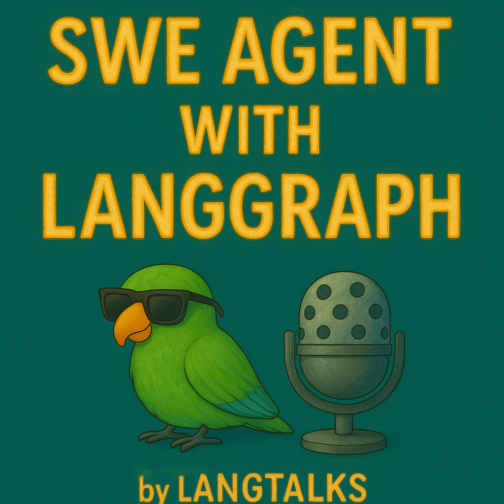
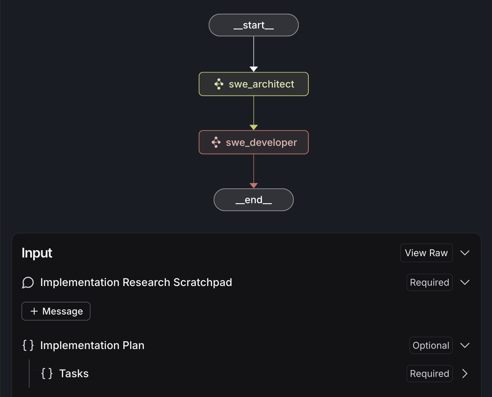
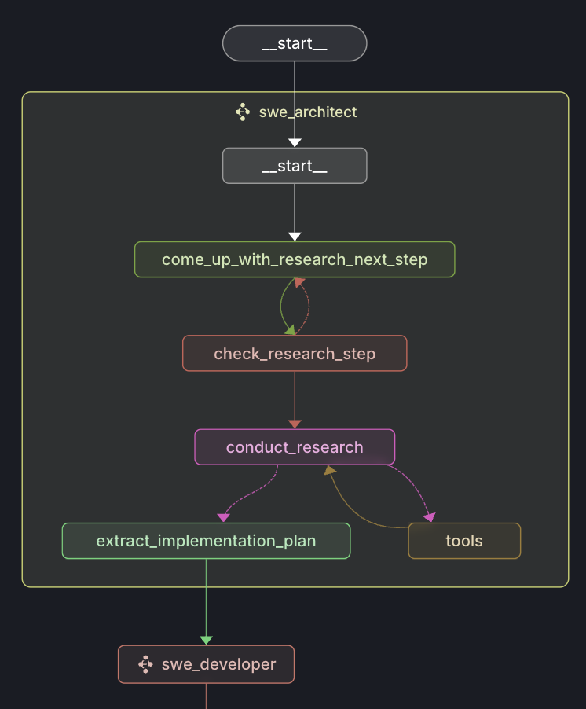
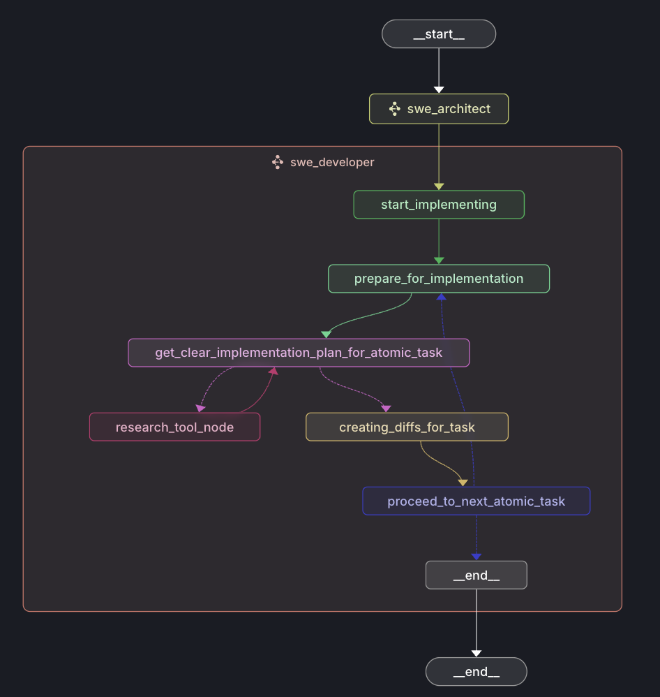
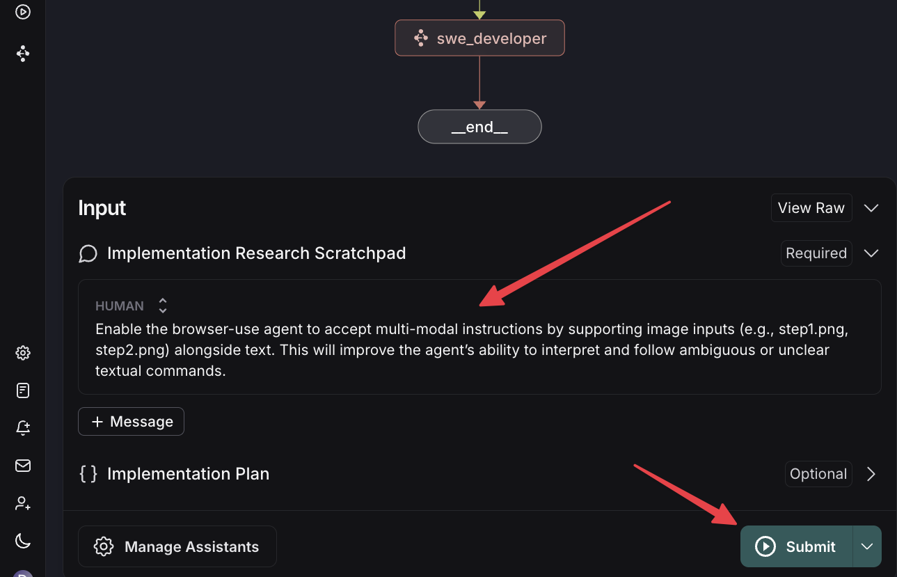
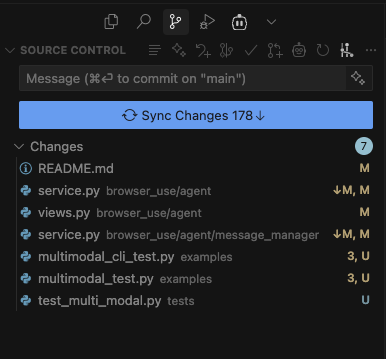

# SWE Agent with LangGraph - by [LangTalks](https://langtalks.ai)




  

A sophisticated AI-powered software engineering agent that automates code implementation through intelligent planning and execution. Built with LangGraph for reliable multi-agent workflows.

> ⚠️ **Alpha Status**: This project is in active development. Features may change and some functionality is experimental. Perfect for early adopters and contributors who want to shape the future of AI-powered development.



[end to end showcase](https://youtu.be/vJNqAgLzOSg)

## 🚀 Features

- **Intelligent Code Planning**: AI architect analyzes requirements and creates detailed implementation plans
- **Automated Code Generation**: Developer agent executes plans with precise file modifications
- **Multi-Agent Workflow**: Separate planning and implementation phases for better reliability
- **Codebase Understanding**: Advanced code analysis using tree-sitter and semantic search
- **Incremental Development**: Atomic task breakdown for safer, more manageable changes

## 🏗️ Architecture

The system uses a two-stage LangGraph workflow:

### 1. Architect Agent - Research & Planning


The architect agent:
- Researches the codebase structure and patterns
- Analyzes requirements and creates hypotheses
- Generates detailed implementation plans with atomic tasks
- Uses tools for code search and semantic understanding

### 2. Developer Agent - Implementation


The developer agent:
- Executes implementation plans step by step
- Performs atomic code modifications with precision
- Creates new files and modifies existing ones
- Validates changes against the original requirements

### Workflow Overview
```
User Request → Architect (Research & Plan) → Developer (Implement) → Results
```

**Key Components:**
- **State Management**: Structured data flow between agents using Pydantic models
- **Tool Integration**: File system operations, code search, and structure analysis
- **Research Pipeline**: Hypothesis-driven exploration of codebases
- **Atomic Execution**: Granular tasks for reliable implementation

## 🔄 Agent State Management

The system uses a hierarchical state management approach with Pydantic models for type safety and validation. Each agent maintains its own state while sharing common entities for seamless data flow.

### Main Agent State (`AgentState`)

The top-level orchestrator state that manages the overall workflow:

```python
class AgentState(BaseModel):
    implementation_research_scratchpad: Annotated[list[AnyMessage], add_messages]
    implementation_plan: Optional[ImplementationPlan] = None
```

**Fields:**
- `implementation_research_scratchpad`: Message history from research and planning phase
- `implementation_plan`: Structured plan created by architect agent for developer execution

### Architect Agent State (`SoftwareArchitectState`)

Manages the research and planning phase with hypothesis-driven exploration:

```python
class SoftwareArchitectState(BaseModel):
    research_next_step: Optional[str] = None
    implementation_plan: Optional[ImplementationPlan] = None  
    implementation_research_scratchpad: Annotated[list[AnyMessage], add_messages] = []
    is_valid_research_step: Optional[bool] = None
```

**Fields:**
- `research_next_step`: Current hypothesis or research direction being explored
- `implementation_plan`: Generated structured plan with atomic tasks
- `implementation_research_scratchpad`: Research conversation history and tool outputs
- `is_valid_research_step`: Validation flag for research hypothesis quality

**Workflow:**
1. Generate research hypothesis → Validate hypothesis → Conduct research → Extract implementation plan

### Developer Agent State (`SoftwareDeveloperState`)

Handles the step-by-step implementation of the architect's plan:

```python
class SoftwareDeveloperState(BaseModel):
    implementation_plan: Optional[ImplementationPlan] = None
    current_task_idx: Optional[int] = 0
    current_atomic_task_idx: Optional[int] = 0
    diffs: Optional[Diffs] = None
    atomic_implementation_research: Annotated[list[AnyMessage], add_messages_with_clear]
    codebase_structure: Optional[str] = None
    current_file_content: Optional[str] = None
```

**Fields:**
- `implementation_plan`: Plan received from architect agent
- `current_task_idx`: Index of current file-level task being implemented
- `current_atomic_task_idx`: Index of current atomic change within the task
- `diffs`: Generated code differences for precise file modifications
- `atomic_implementation_research`: Research specific to current implementation step
- `codebase_structure`: Current snapshot of target codebase structure
- `current_file_content`: Contents of file being modified

**Workflow:**
1. Iterate through tasks → Research specific implementation → Generate diffs → Apply changes

### Shared Entities

These Pydantic models provide the data contracts between agents:

#### `ImplementationPlan`
```python
class ImplementationPlan(BaseModel):
    tasks: List[ImplementationTask]
```
The top-level plan containing all file-level implementation tasks.

#### `ImplementationTask`  
```python
class ImplementationTask(BaseModel):
    file_path: str                    # Target file for modifications
    logical_task: str                 # High-level description of changes
    atomic_tasks: List[AtomicTask]    # Granular modification steps
```
Represents changes needed for a specific file.

#### `AtomicTask`
```python
class AtomicTask(BaseModel):
    atomic_task: str            # Specific code modification instruction
    additional_context: str     # Research context for this change
```
The smallest unit of implementation - a single code change.

#### `DiffTask` (Developer-specific)
```python
class DiffTask(BaseModel):
    original_code_snippet: str    # Exact code being replaced
    task_description: str         # Detailed change instructions
```
Precise diff instructions for code modifications.

### State Flow Example

```
User Request
    ↓
AgentState {research_scratchpad: [HumanMessage("Add auth")]}
    ↓
SoftwareArchitectState {
    research_next_step: "Find existing auth patterns",
    implementation_research_scratchpad: [research_messages...]
}
    ↓ (after research)
SoftwareArchitectState {
    implementation_plan: ImplementationPlan([
        ImplementationTask(
            file_path: "auth.py",
            atomic_tasks: [AtomicTask("Add User model")]
        )
    ])
}
    ↓
SoftwareDeveloperState {
    implementation_plan: <received_plan>,
    current_task_idx: 0,
    current_atomic_task_idx: 0,
    current_file_content: "# auth.py content"
}
    ↓ (after implementation)
Final Result: Modified codebase
```

### State Management Benefits

- **Type Safety**: Pydantic validation prevents state corruption
- **Traceability**: Complete message history for debugging
- **Resumability**: State can be persisted and resumed
- **Modularity**: Each agent manages its own concerns
- **Atomicity**: Granular task breakdown enables precise control

## 📋 Prerequisites

- Python 3.12+
- uv (Python package manager)
- Anthropic API key (Claude Sonnet 4)

## ⚡ Quick Start

1. **Clone the repository**
```bash
git clone https://github.com/langtalks/swe-agent-langgraph.git
cd swe-agent-langgraph
```

2. **Set up environment**
```bash
# Install dependencies with uv
uv sync

# Create environment file
cp .env.example .env
# Add your Anthropic API key to .env
```

3. **Run the agent**
```bash
# Activate environment
source .venv/bin/activate

# Start LangGraph server
langgraph dev

```

4. **Example usage**
Input:


Output: (browsing the workspace repo git)



## 🛠️ Development

### Project Structure
```
agent/
├── architect/          # Planning and research agent
│   ├── graph.py       # Main architect workflow
│   ├── state.py       # State definitions
│   └── prompts/       # Prompt templates
├── developer/          # Implementation agent  
│   ├── graph.py       # Main developer workflow
│   ├── state.py       # State definitions
│   └── prompts/       # Prompt templates
├── common/            # Shared entities and state
│   └── entities.py    # Pydantic models
└── tools/             # File operations and search tools
    ├── search.py      # Code search tools
    ├── codemap.py     # Code analysis tools
    └── write.py       # File operations

workspace_repo/        # Target codebase for modifications
scripts/              # Utility scripts
helpers/              # Prompt templates and utilities
static/               # Documentation images
```

### Core Components

**Entities & State Management:**
- `ImplementationPlan`: Structured task breakdown
- `AtomicTask`: Individual code modification units
- `ImplementationTask`: File-level implementation steps

**Agent Workflows:**
- Research-driven planning with hypothesis validation
- Tool-assisted code exploration and analysis
- Incremental implementation with verification

### Running Tests
```bash
# Run all tests
uv run pytest

# Run with coverage
uv run pytest --cov=agent

# Run specific test modules
uv run pytest tests/test_architect.py
```

## 📁 Main Directory Files

| File | Description |
|------|-------------|
| `README.md` | Project documentation (this file) |
| `pyproject.toml` | Python project configuration and dependencies |
| `langgraph.json` | LangGraph application configuration with graph definitions |
| `langgraph_debug.py` | Debug configurations for development and testing |
| `uv.lock` | Locked dependency versions for reproducible builds |
| `.env` | Environment variables (create from .env.example) |
| `.env.example` | Template for environment configuration |
| `.gitignore` | Git ignore patterns for Python and IDE files |
| `.python-version` | Python version specification for pyenv |

## 🎯 Use Cases

- **Feature Development**: Implement new features based on high-level requirements
- **Bug Fixes**: Analyze and fix issues with automated code changes
- **Code Refactoring**: Restructure code while maintaining functionality
- **Documentation**: Generate and update code documentation
- **Testing**: Create test cases and fix failing tests

## 🗺️ Roadmap - LangTalks Community Project!

We're building the future of AI-powered software development together! These are the next major features we're looking for community contributions on:

### 🔄 Core Agent Enhancements
- [ ] **Multi-step Research & Development Loop**: Iterative refinement of implementation plans with feedback cycles
- [ ] **Testing Agent**: Dedicated agent for unit testing, functional testing, and test case generation  
- [ ] **Error Fixer Agent**: Specialized agent for detecting, analyzing, and fixing code errors
- [ ] **Product Manager Agent**: High-level planning and requirement analysis agent

### 🔧 Development Tools & Quality
- [ ] **Add Linters**: Integrate code quality tools (ESLint, Black, Pylint) into the workflow
- [ ] **Components Evaluation Benchmarking**: Performance metrics and quality assessment frameworks
- [ ] **Code Semantic Indexing**: Advanced code understanding and similarity detection

### 🌐 Integrations & Connectivity  
- [ ] **GitHub MCP Integration**: Direct integration with GitHub repositories and workflows
- [ ] **Context7 MCP Integration**: Enhanced context management and code understanding
- [ ] **Multi-Language Support**: Extend beyond Python to JavaScript, TypeScript, Java, Go, etc.

### 📈 Advanced Features (Future)
- [ ] **Interactive Planning UI**: Web interface for plan review and modification
- [ ] **Collaborative Workflows**: Multi-developer coordination and conflict resolution
- [ ] **Performance Optimization**: Faster research and implementation cycles
- [ ] **Plugin System**: Extensible tool and agent architecture

> **Want to contribute?** Pick any feature above and join our LangTalks community! Each feature is designed to be tackled by individual contributors or small teams.

## 🤝 Contributing

We welcome contributions! This project aims to push the boundaries of AI-powered software development. Areas where we need help:

### Priority Areas
- **Agent Improvements**: Better reasoning and planning strategies
- **Tool Development**: New code analysis and modification tools
- **Testing**: Comprehensive test coverage and validation frameworks
- **Documentation**: Examples, tutorials, and use cases
- **Performance**: Optimization and benchmarking

### How to Contribute

1. **Fork the repository**
2. **Create a feature branch** (`git checkout -b feature/amazing-feature`)
3. **Make your changes** following the existing code patterns
4. **Add tests** for new functionality
5. **Ensure tests pass** (`uv run pytest`)
6. **Update documentation** if needed
7. **Commit your changes** (`git commit -m 'Add amazing feature'`)
8. **Push to the branch** (`git push origin feature/amazing-feature`)
9. **Open a Pull Request** with a clear description

### Development Setup

```bash
# Clone your fork
git clone https://github.com/langtalks/swe-agent-langgraph.git
cd swe-agent-langgraph

# Set up development environment
uv sync --dev

# Install pre-commit hooks (optional but recommended)
pre-commit install

# Run tests to ensure everything works
uv run pytest
```

## 📊 Technical Details

### Dependencies
- **LangGraph**: Multi-agent workflow orchestration
- **LangChain**: AI integration and tool management
- **Anthropic**: Claude Sonnet 4 for intelligent reasoning
- **Tree-sitter**: Robust code parsing and analysis
- **Pydantic**: Type-safe data validation and serialization

### Performance Considerations
- Atomic task execution for reliability
- Efficient code analysis with tree-sitter
- Structured state management for scalability
- Tool-based architecture for extensibility

## 🔧 Configuration

Key configuration files:
- `langgraph.json`: Defines agent graphs and dependencies
- `.env`: API keys and environment variables
- `pyproject.toml`: Python dependencies and project metadata

## 📄 License

This project is licensed under the MIT License - see the [LICENSE](LICENSE) file for details.

## 🙏 Acknowledgments

- Built with [LangGraph](https://langchain-ai.github.io/langgraph/) for reliable agent workflows
- Powered by [Anthropic Claude](https://www.anthropic.com/) for intelligent reasoning
- Uses [tree-sitter](https://tree-sitter.github.io/) for robust code parsing
- Inspired by advances in AI-powered software development

## 📞 Support & Community

- **LangTalks Homepage**: Visit [www.langtalks.ai](https://www.langtalks.ai) for community resources and support
- **Issues**: Report bugs and request features via [GitHub Issues](https://github.com/langtalks/swe-agent-langgraph/issues)
- **Discussions**: Join conversations in [GitHub Discussions](https://github.com/langtalks/swe-agent-langgraph/discussions)
- **Documentation**: Complete documentation is available in this README

---

**Ready to revolutionize software development with AI? Join us at [LangTalks](https://www.langtalks.ai) and help build the future of automated coding!** ⚡🤖